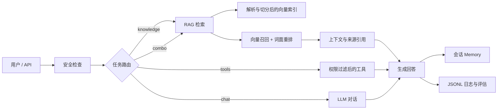

# 星海智联企业知识与办公智能 Agent

这是一个使用 Python、LangChain 1.x、Streamlit 和 FastAPI 构建的教学型企业 Agent 项目。它覆盖对话、LLM、Prompt、Agent、Tool Calling、RAG、Memory、Context、权限、安全、日志和评估，同时刻意避免为了“企业级”而堆叠难以理解的基础设施。

项目默认以 `DEMO_MODE=true` 运行，不需要 API Key：真实解析五类企业文档、建立本地向量索引、执行检索与重排、返回来源引用，并能运行安全计算器和 Excel 查询。配置真实 LLM 后，Agent 会使用 LangChain `create_agent` 自动选择工具并返回 Pydantic 结构化结果。

## 1. 能力清单

- 用户对话：Streamlit Web 界面、FastAPI 接口、多会话隔离。
- Agent 路由：普通对话、知识库、工具、知识库与工具组合四条路径。
- LLM：默认 OpenAI 适配器，可通过工厂扩展其他提供商。
- Prompt：YAML 集中管理，业务文字与代码解耦。
- Tool Calling：LangChain 1.x `create_agent`，工具参数由 Pydantic 校验。
- RAG：PDF、DOCX、XLSX、TXT、Markdown 解析；中文递归切分；Embedding；持久化向量检索；混合重排；来源引用。
- Memory：按 `session_id` 保存最近 12 条消息，并用字符上限二次约束。
- Context：把用户、角色、部门和裁剪后的历史组合成模型上下文。
- 权限：角色到工具、角色到文档范围的 RBAC 策略。
- 安全：输入长度限制、Prompt Injection 检测、日志 PII 脱敏、目录穿越拦截、安全算术 AST、外部写操作人工确认接口。
- 日志：控制台和 JSONL 文件双输出，每个请求有 `request_id`。
- 评估：引用覆盖、答案非空、知识回答引用格式等轻量指标。
- 企业扩展：CRM、ERP、邮件、日历适配器骨架，写操作默认要求确认。

## 2. 系统工作流程



## 3. 工程目录

```text
KnowledgeWorkingAgent/
├─ app/
│  ├─ agent/          # 任务路由和统一执行服务
│  ├─ auth/           # RBAC 权限策略
│  ├─ context/        # 上下文组装
│  ├─ core/           # 配置和数据模型
│  ├─ evaluation/     # 输出质量评估
│  ├─ llm/            # 模型工厂
│  ├─ memory/         # 短期会话记忆
│  ├─ observability/  # 结构化日志
│  ├─ prompts/        # Prompt 读取器
│  ├─ rag/            # 文档到引用的完整 RAG 管线
│  ├─ security/       # 输入、PII 和路径防护
│  └─ tools/          # 内置工具及企业扩展接口
├─ api/               # FastAPI 服务
├─ ui/                # Streamlit Web 对话界面
├─ configs/           # 设置、Prompt、权限 YAML
├─ data/
│  ├─ knowledge_base/ # 五份星海智联测试知识文档
│  └─ vector_store/   # 运行时生成的本地索引
├─ docs/              # 架构、设计稿和原始结构参考
├─ explain/           # 与每个 Python 源文件一一对应的教学说明
├─ scripts/           # 索引和评估入口
├─ tests/             # 单元与集成测试
├─ .env.example
├─ requirements.txt
└─ run.py
```

## 4. 快速开始

要求 Python 3.11、3.12 或 3.13。推荐在项目根目录执行：

```powershell
python -m venv .venv
.\.venv\Scripts\Activate.ps1
python -m pip install -r requirements-dev.txt
Copy-Item .env.example .env
python scripts\ingest.py
python run.py
```

浏览器会打开 `http://localhost:8501`。可以直接测试：

- `公司标准工单首次响应时间是多久？`
- `知识库支持哪些常见文件类型？`
- `请计算 (1250 + 860) * 0.13`
- `查询销售数据表中包含“华南”的记录`

默认演示模式会返回真实检索片段和引用，但不会调用在线 LLM。

## 5. 启用真实 LLM

复制 `.env.example` 为 `.env`，至少填写：

```dotenv
DEMO_MODE=false
OPENAI_API_KEY=你的密钥
```

模型名在 `configs/settings.yaml` 的 `llm.model` 中配置。若企业使用 OpenAI 兼容网关，可同时设置 `OPENAI_BASE_URL`。不要把 `.env` 提交到 Git；项目已在 `.gitignore` 中排除它。

## 6. Embedding 为什么这样设计

默认 `embedding.provider=hash` 是为了让学习者不下载数百 MB 模型、不配置密钥也能完成端到端运行。它把中文单字和双字组合稳定哈希到 384 维空间，具备“可重复、可测试、零网络”的工程价值，但语义理解弱，不能作为生产质量基准。

生产中文知识库推荐将 provider 改为 `huggingface`，模型使用配置中预留的 `BAAI/bge-small-zh-v1.5`。它体积和效果相对均衡，适合中文短查询与段落检索。需要额外安装：

```powershell
python -m pip install langchain-huggingface sentence-transformers
```

也可选择 `openai`，复用托管 Embedding，代价是网络、费用与数据出境评估。

## 7. 为什么按字符递归切分

当前材料以中文制度、产品说明、FAQ 和表格文本为主。中文没有稳定空格边界，直接固定字符硬切会把一句话从中间截断；纯语义切分则需要额外模型、速度更慢，也更难向初学者解释和测试。因此使用 LangChain 官方推荐的 `RecursiveCharacterTextSplitter`，分隔优先级为：段落、换行、中文句号/问号/分号/逗号、英文标点、空格、最后才是单字符。

- `chunk_size=800`：中文约 400—800 个有效字，通常能容纳一个制度小节。
- `chunk_overlap=120`：约 15% 重叠，避免答案跨边界时两边都缺上下文。
- PDF 按页、Excel 按工作表先形成解析单元，再做二次切分，因此引用仍保留页码或工作表。

这些值不是“万能最佳值”。生产环境应基于真实问答集比较召回率、上下文噪声、延迟和成本后调整。

## 8. 检索、重排与引用

第一阶段计算查询向量与文档向量的余弦相似度，召回 8 个候选。第二阶段用查询与文档的中文双字/英文词交集计算词面分，再按 `0.7 × 向量分 + 0.3 × 词面分` 重排，保留前 4 个。这样能补足纯向量模型对产品名、金额、制度编号等精确词的忽略。

每个结果生成稳定的 `[S1]`、`[S2]` 编号，并携带文件名、页码/工作表/分块号、片段和得分。真正的 LLM Prompt 被限制为只依据这些上下文回答。若无证据，系统明确返回“当前知识库证据不足”。

## 9. Memory 与上下文窗口

Memory 使用进程内字典，适合单机学习和测试。每个会话最多保存 12 条消息，同时不得超过 12000 字符。双重窗口避免“消息很少但单条特别长”拖垮模型上下文。生产多实例部署时应替换为 Redis/PostgreSQL，并增加用户租户键、过期时间、加密和删除策略。

## 10. API

启动：

```powershell
python -m uvicorn api.main:app --reload --port 8000
```

主要接口：

- `GET /health`：健康状态和索引分块数。
- `POST /api/v1/chat`：对话统一入口。
- `POST /api/v1/knowledge/reindex`：重建知识库索引。
- `DELETE /api/v1/sessions/{session_id}`：清除短期记忆。
- `GET /docs`：FastAPI 自动接口文档。

示例请求：

```json
{
  "message": "标准工单多久响应？",
  "session_id": "employee-001",
  "mode": "auto",
  "user": {
    "user_id": "u-001",
    "display_name": "小海",
    "roles": ["employee"],
    "department": "产品与研发中心"
  }
}
```

## 11. 测试与质量检查

```powershell
python -m pytest
python -m pytest --cov=app --cov=api --cov-report=term-missing
python -m ruff check .
python scripts\evaluate.py
```

测试覆盖配置、五类文档解析、中文切分、Embedding 稳定性、RAG 引用、安全计算、PII、权限、Memory、路由、服务和 API。

## 12. 安全边界与生产化清单

这个仓库展示的是可扩展骨架，不应未经加固直接处理真实敏感数据。上线前至少完成：

1. 用公司 SSO/OIDC 替换演示用户，并从可信 Token 取得角色，不能相信前端上传的角色字段。
2. 文档在入库和检索两个阶段都做租户、部门、密级过滤。
3. 把本地 JSON 向量索引替换为支持并发、备份和权限过滤的向量数据库。
4. 把进程内 Memory 替换为带 TTL、加密和删除能力的共享存储。
5. Web 搜索建立域名白名单、内容清洗和外部数据泄露策略。
6. CRM/ERP/邮件/日历写操作使用最小权限服务账号、幂等键和真实审批单。
7. 对日志实施访问控制、保留期限、完整 PII/DLP 检查和不可抵赖审计。
8. 构建真实问答评估集，持续测量召回率、忠实度、越权率、注入成功率、延迟与成本。

## 13. 逐文件学习文档

`explain/` 目录中的 Markdown 与每个 Python 文件一一对应，逐个解释职责、导入、类、函数、参数、调用链、为什么这样设计、常见问题、面试问题和扩展方向。建议阅读顺序：

1. `app.core.schemas.py.md` 与 `app.core.config.py.md`
2. `app.rag.*.py.md`
3. `app.tools.*.py.md`
4. `app.agent.router.py.md` 与 `app.agent.service.py.md`
5. `ui.app.py.md`、`api.main.py.md`
6. `tests.*.py.md`

## 14. 许可证与数据说明

项目中的“星海智联”及全部业务数据均为虚构，仅用于学习、面试和 RAG 测试。仓库采用 MIT License。
